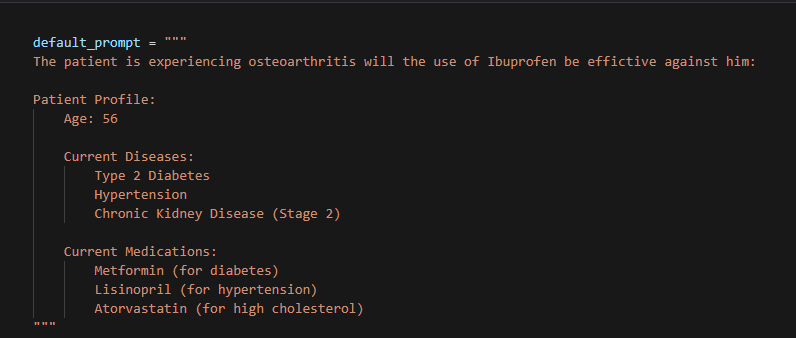
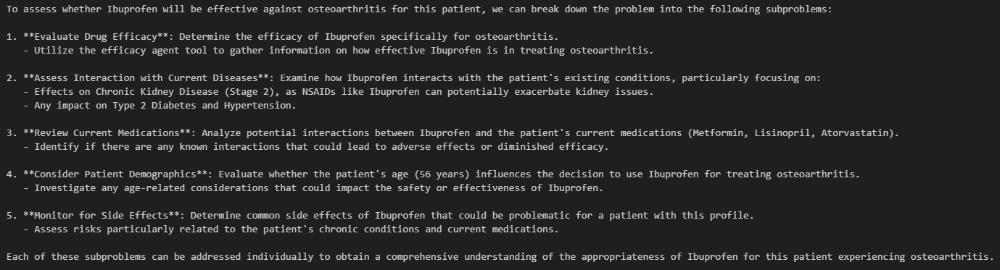
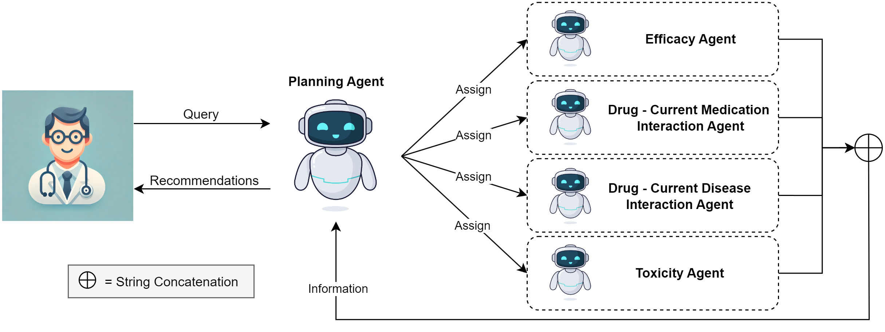
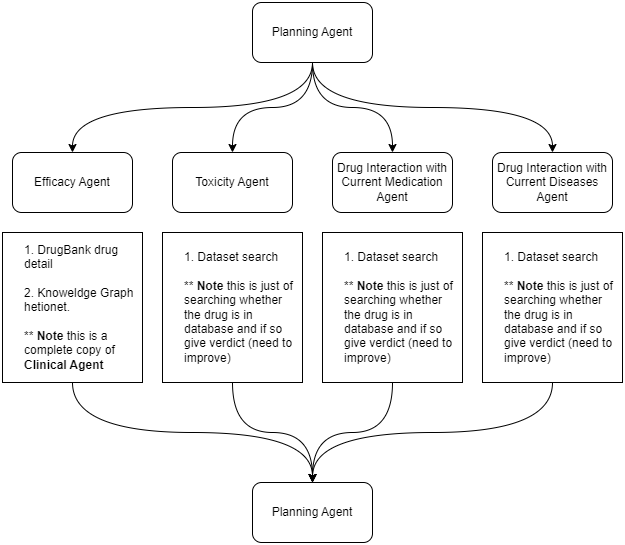

# DoctorAssist

## Example Prompt  and Output Examples.

### Process FlowDiagram.

### Component details

### Improvements.

1. Use shapely to provide insights in to the subcomponents so the answer is not just a probability but also insight into why. 

### How to Evaluate.

1. Create dataset from TDC combining the dataset available to evaluate the model.
2. dataset creation.
	1. Use the information in TDC.
	2. consider having disease interaction in hit rates and analyse the effects.
3. Ablation study
